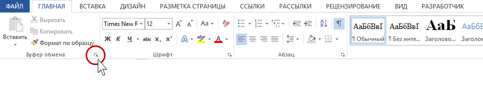
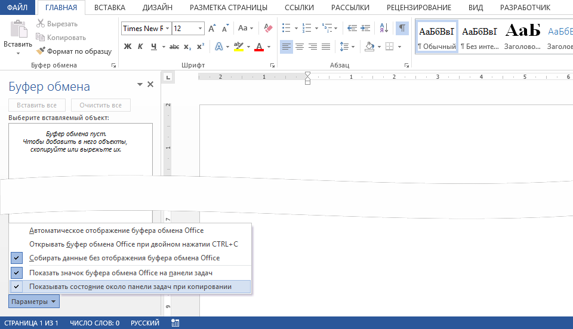

**Буфер обмена** -- это временное хранилище, куда попадают все скопированные или вырезанные вами тексты, картинки и другие объекты. Его главное преимущество в Office -- возможность просмотреть историю и вставить сразу несколько элементов.

{width=960px height=170px}

{width=960px height=551px}

У офисных программ есть замечательная особенность: **сохранение в буфере обмена до 24 (!) фрагментов**. Причём, не важно каких: размер, вид, объём – всё это не важно. Одно копирование – один фрагмент. 

Данные в количестве до 24 фрагментов будут собираться в буфере обмена вне зависимости открыто окно Буфера обмена или нет. Если вы скопировали больше 24 раз, то информация, скопированная первой, исчезнет, и так по кругу.

Если вы копируете информацию в другой неофисной программе (например, делаете скриншоты), то эта информация в количестве до 24 фрагментов будут собираться в буфере обмена Office. 

Буфер обмена настраивается один раз. Если вы закроете окно Буфера обмена, то настройки сохраняться.

Если вам необходимо вставить фрагмент, скопированный ранее, то откройте окно Буфера обмена. Далее из списка скопированный фрагментов выберите нужный вам фрагмент и щёлкните на нём ЛМ – фрагмент вставиться из буфера обмена.