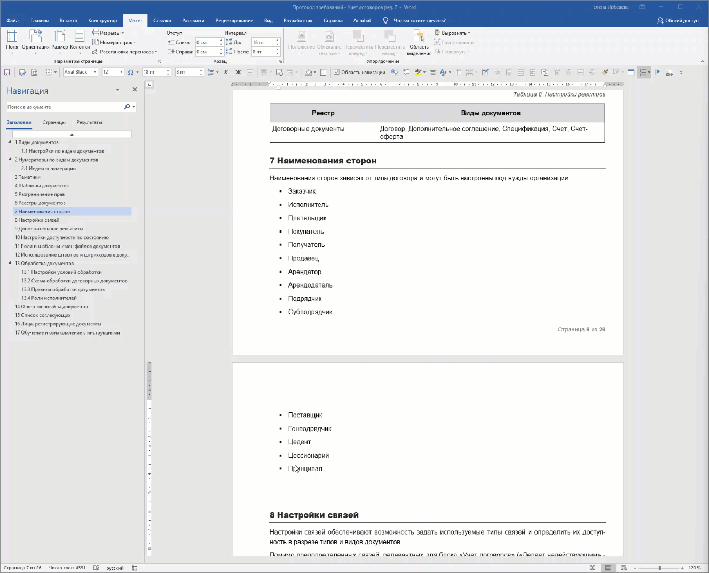

Не растягивайте длинные списки на всю ширину страницы. Размещайте их в несколько колонок -- так они читаются быстрее и экономят место.

1. **Выделите текст** списка, который нужно разбить на колонки.

2. Перейдите на вкладку **Макет** .

3. В группе **Параметры страницы** нажмите кнопку **Колонки**.

4. Выберите готовый шаблон:

   -  **Две** -- для размещения в две колонки.

   -  **Три** -- для размещения в три колонки.

{width=1328px height=1074px}