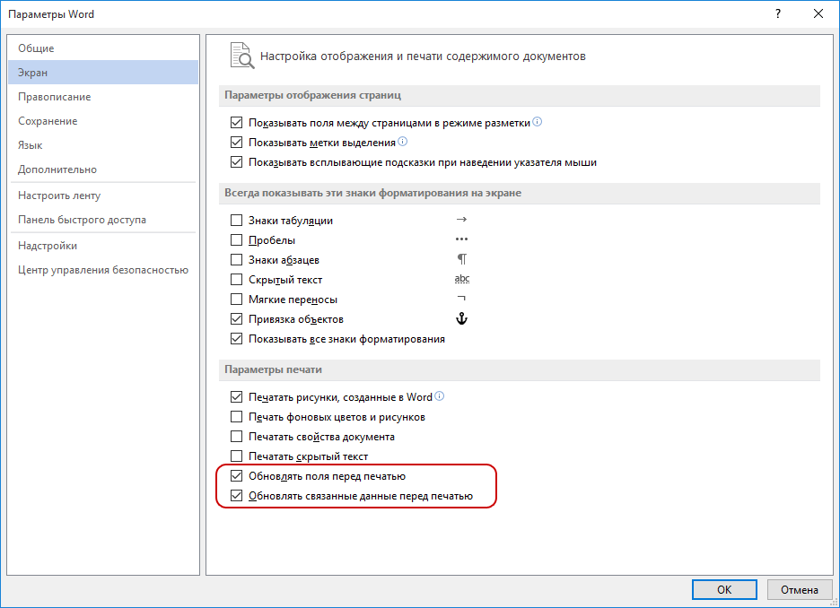
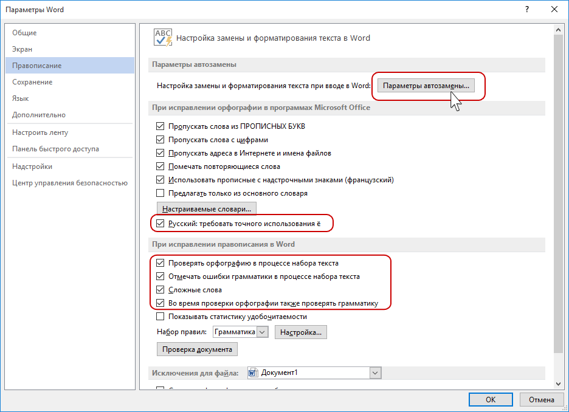
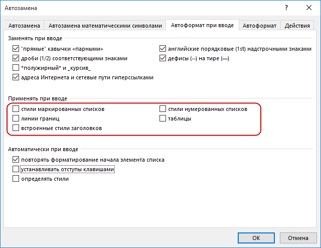
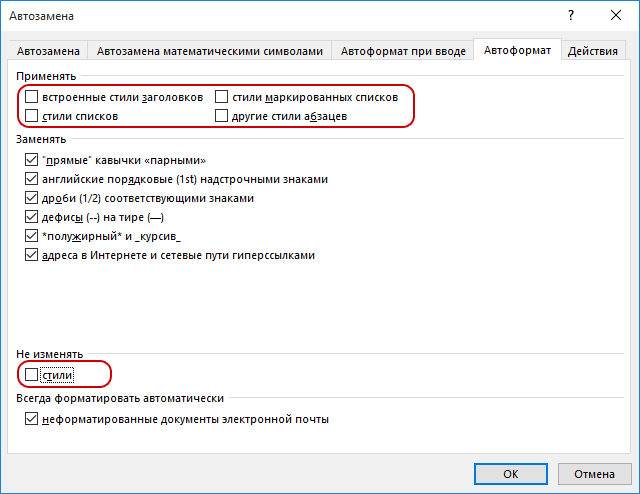
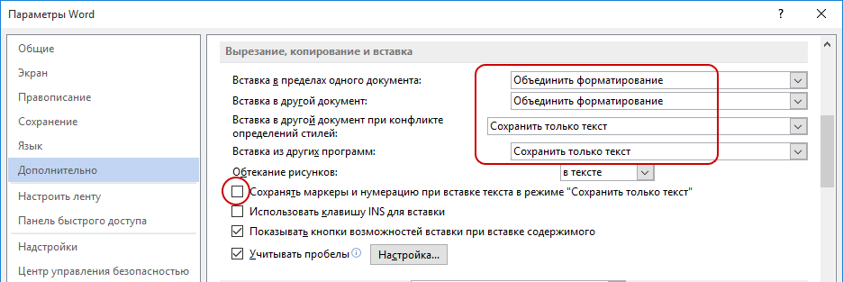
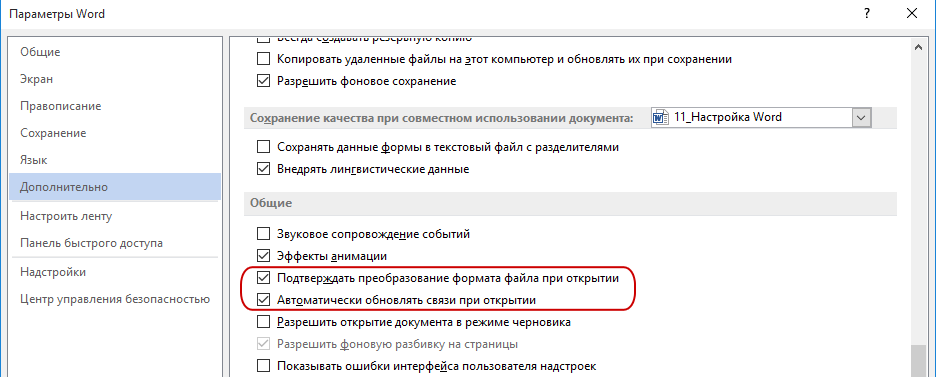

Для настройки рекомендованных параметров перейдите **Файл -- Параметры**

## 1\. Вкладка Экран

{width=936px height=678px}

## 2\. Вкладка Правописание

{width=936px height=678px}

При включенной настройке **Требовать точного использования ё** будут подчеркиваться слова, в которых вместо **е** должна быть буква **ё**. Если вы находите это излишним -- не устанавливайте этот флаг.

{width=640px height=494px}

{width=640px height=494px}

## 3\. Вкладка Дополнительно

{width=936px height=313px}

{width=936px height=377px}