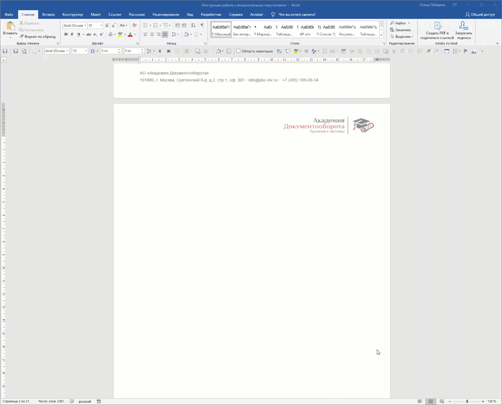

:::note 

**Главное правило!**

Все заголовки вашего документа должны быть заданы с помощью стилей Заголовок 1, Заголовок 2 и т.д.\
См. [Шаблон документа и стили](http://tauri.localhost/gitlab.docflow.academy/gramax/programs/main/-/microsoft-word/shablon-dokumenta-i-stili)

:::

## Создание автоматического оглавления

-  Поставьте курсор на место, где должно быть оглавление.

-  Перейдите во вкладку **Ссылки --** **Оглавление**.

-  Выберите один из Автособираемых шаблонов.

-  Word сам соберет все заголовки, проставит номера страниц и отформатирует список.

**Если внесли изменения**

-  Исправили заголовок или добавили раздел

-  **Щелкните правой кнопкой по оглавлению** и выберите **Обновить поле**.

-  Выберите **Обновить целиком --** **OK**.

{width=1328px height=1074px}

## Навигация

-  Перейдите во вкладку **Вид** и поставьте галочку **Область навигации**.

-  Слева откроется панель со всеми вашими заголовками.

-  **Чтобы мгновенно перейти к любому разделу** -- просто щелкните по его названию в этой панели.

{width=1328px height=1074px}

## Настройка уровней отображения

Щелкните правой кнопкой мыши по любому заголовку в панели. В контекстном меню вы можете:

-  **Показать уровни заголовков** выбрать, сколько уровней вложенности показывать (Все, Отобразить заголовок 1, Отобразить заголовок 2 и т.д.).

-  **Развернуть/Свернуть** отдельные разделы, щелкая по треугольникам слева от заголовков.

## Перемещение и изменение структуры

**Чтобы переместить весь раздел** просто перетащите нужный заголовок в панели навигации выше или ниже. Весь текст этого раздела (включая подразделы и содержимое) переместится вместе с ним в новое место документа. Это гораздо быстрее, чем копировать-вставлять куски текста.

**Чтобы изменить уровень заголовка:**\
Щелкните правой кнопкой мыши по заголовку в панели и выберите:

-  Повысить уровень (или Shift+Tab) -- сделать, например, из Заголовка 2 -- Заголовок 1.

-  Понизить уровень (или Tab) -- сделать, например, из Заголовка 2 -- Заголовок 3.