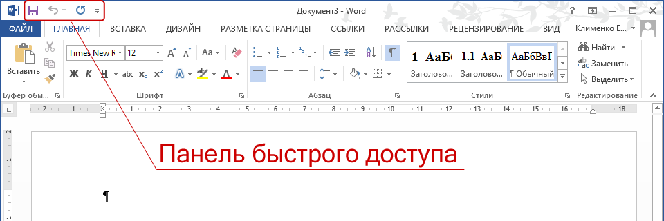
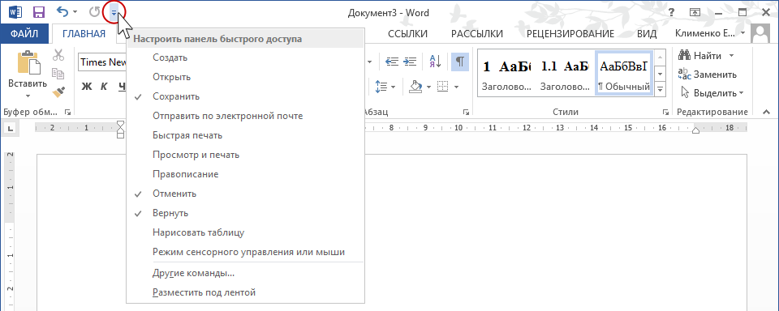
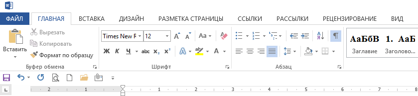
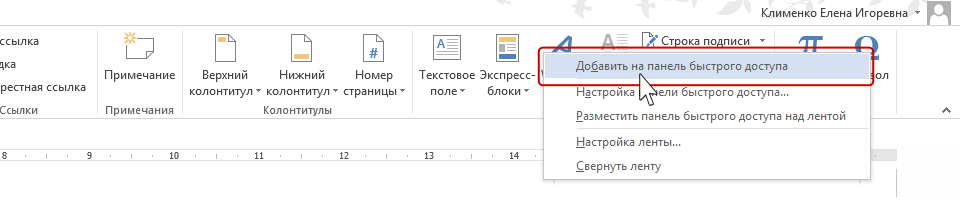
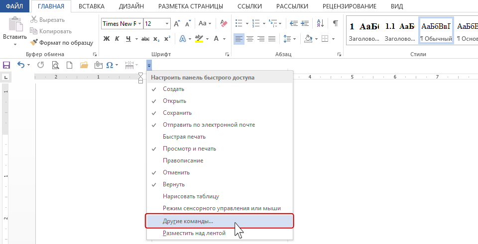
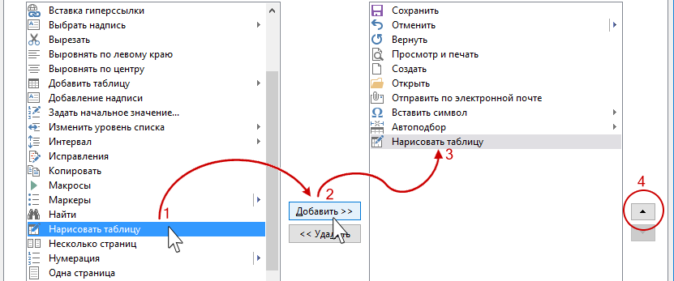

**Панель быстрого доступа** -- это ваша личная панель с самыми нужными кнопками, которая всегда под рукой, чтобы не искать команды по вкладкам.\
Это маленькая панелька, расположенная по умолчанию самом верху окна Word(обычно слева от названия файла), где можно разместить значки самых часто используемых команд. Она всегда видна, на какой бы вкладке вы ни были.

{width=960px height=320px}

{width=960px height=384px}

Выберите **Разместить под лентой**

{width=839px height=193px}

Любую команду можно добавлять на панель быстрого доступа, нажав на нее правой кнопкой мышки

{width=960px height=221px}

Потратьте 5 минут один раз, чтобы добавить то, чем пользуетесь каждый день. Это сэкономит вам часы в будущем.

**Панель быстрого доступа -- ваш главный инструмент для скоростной работы.**

Рекомендуется добавить:

-  Интервалы абзаца

-  Область навигации

-  Добавление названий (для рисунков и таблиц)

-  Создание примечаний

-  Выравнивание по ширине и/или по центру

-  Команды для работы с таблицами: вставить/удалить строку и столбец, объединить ячейки\
   и другие команды, которыми вы часто пользуетесь при работе с документами

Некоторые команды не получится явно добавить на панель с помощью контекстного меню, но их можно настроить через меню настроек. Также с помощью настроек можно изменить расположение команд на панели и добавить разделители.

{width=960px height=491px}

{width=831px height=347px}

Выбираем строчку «Все команды». В результате в левом списке будут расположены все команды по алфавиту