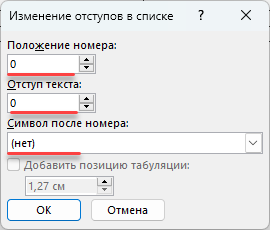

## Базовое оформление текста

-  Выделите всю таблицу.

-  Примените стиль **Без интервала**. Это уберет лишние отступы и сделает таблицу компактнее.

## Добавление "воздуха"

-  Не снимая выделения, перейдите в **Работа с таблицами** -- **Макет**.

-  Нажмите кнопку **Поля ячейки**.

-  Установите **верхнее** и **нижнее** значение **0,1 см**. Это создаст комфортный отступ текста от границ ячейки.

## Списки внутри таблицы

-  Если в ячейках нужны списки, применяйте к ним специальный стиль **Таблица список**. У него уменьшены отступы, чтобы экономить место.

## Столбец с нумерацией

-  Выделите первый столбец.

-  Примените стиль **№ п/п**. Нумерация проставиться автоматически.\
   1\. Если вы добавляете в документ несколько таблиц с нумерацией в первой колонке, то каждая следующая таблица будет продолжать нумерацию предыдущей. Чтобы этого избежать, нажмите на ПМ на номер и выберите **Начать заново с 1**\
   2\. Чтобы задать нумерацию в таблице отличную от 1, 2, 3.... нужно выбрать через **Главное -- Нумерация** нужный вариант нумерованного списка и после вставки **Изменить отступы в списке** до следующих значений

   {width=270px height=230px}

-  Удалите номер в первой строке, если это заголовок таблицы.

## Оформление шапки (заголовков столбцов)

-  Выделите первую строку.

-  Задайте визуальное оформление:

   -  **Заливка** -- серый цвет.

   -  **Выравнивание** -- по центру.

   -  **Шрифт** -- полужирный.

## Повтор шапки на каждой странице ⚠️

-  Не снимая выделения с первой строки, щелкните правой кнопкой мыши.

-  Выберите **Свойства таблицы** -- вкладка **Строка**.

-  Поставьте галочку **Повторять как заголовок на каждой странице**.

-  **Готово.** Теперь при разрыве таблицы шапка автоматически продублируется на следующей странице.

## Сохраните как экспресс-блок (шаблон)

Чтобы не настраивать каждый раз:

1. Выделите готовую отформатированную таблицу.

2. Перейдите: **Вставка --** **Экспресс-блоки --** **Сохранить выделенный фрагмент в коллекцию...**.

3. Дайте ей понятное имя.

4. Теперь вы можете вставить её в любой документ через **Вставка --** **Экспресс-блок** -- выберите вашу таблицу.

[video:https://drive.google.com/file/d/1OmMJ_uLfjoXjFRflEvFrHSFAS3OzDuyG/view?usp=sharing]