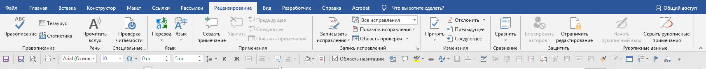
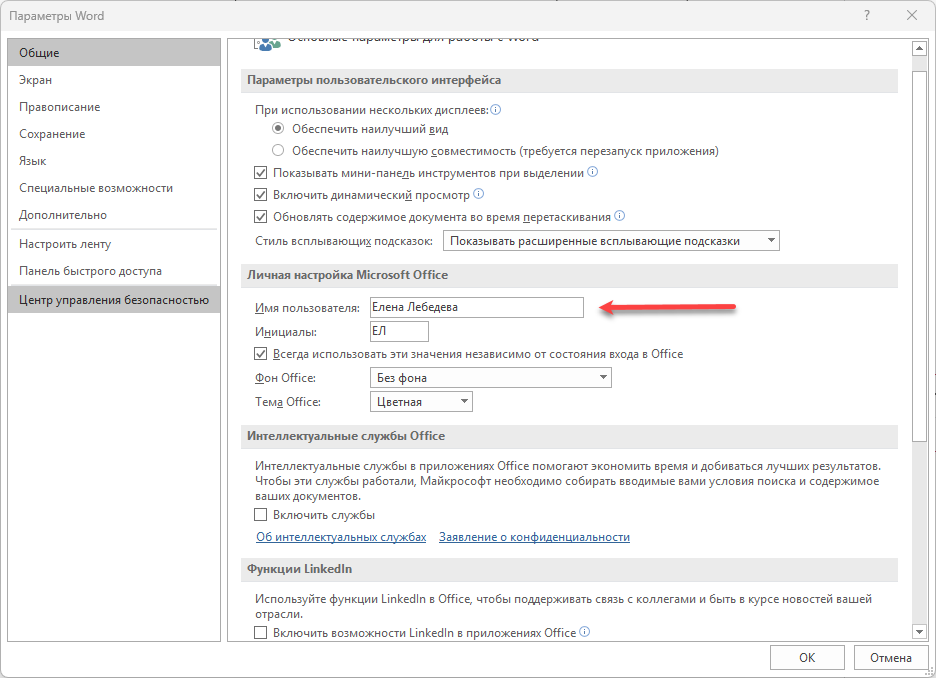
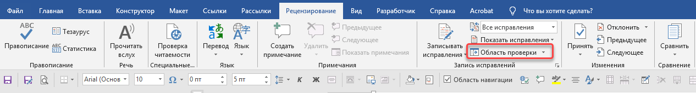
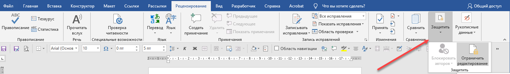

Вкладка **Рецензирование** -- это главный инструмент для командной правки документов. Она позволяет комментировать, предлагать правки и отслеживать все изменения, не удаляя исходный текст.

Никогда не правите документы «в лоб». Всегда используйте Рецензирование -- это профессионально и избегает потери информации.

{width=1714px height=171px}

## Примечания

Нужны чтобы оставить вопрос, предложение или заметку для себя или коллеги без редактирования самого текста.

Выделите слово или фразу, нажмите **Рецензирование -- Создать примечание** или ПМ -- Создать примечание.

Что можно с ними делать:

-  Отвечать на комментарии других: кнопка **Ответить** 

-  Помечать как принятый (он становится бледнее, но не удаляется): кнопка **Разрешить**

-  Удалять: ПМ -- **Удалить примечание**

:::tip 

За отображение имени при создании примечания отвечает настройка **Имя пользователя**, расположенная в меню **Файл -- Параметры -- Общие**

**Настройте ваше реальное имя один раз. Это обязательно для корректной работы в команде.**

{width=936px height=678px}

**Имя автора «зашивается» в комментарий в момент его создания.** Если вы потом измените имя в настройках, **старые комментарии не переименуются.** Изменится только авторство у новых.

:::

## Исправления

Режим записи исправлений записывает все изменения: удаления, добавления, перемещения текста. Исходный текст остается на месте, но перечёркивается, а новые правки подчеркиваются цветом.

**Как включить/выключить:** Нажмите кнопку **Записывать исправления** на вкладке Рецензирование. Лучше не выключать, пока правка не закончена.

**Как работать с правками:**

-  Кнопка **Принять**. Изменение применяется, а пометка убирается.

-  Кнопка **Отклонить**. Изменение отменяется, возвращается исходный текст.

-  **Принять/отклонить все изменения сразу:** Нажмите стрелку под кнопкой -> выберите соответствующий пункт.

## Область проверки

Показывает вертикальный список всех правок и комментариев в документе. Незаменима для больших документов, так как позволяет быстро увидеть все изменения в одном месте, не прокручивая весь текст.

{width=1266px height=170px}

## Защита документа

Перед отправкой документа на согласование или проверку вы можете настроить его защиту и разрешить только комментировать, но не менять текст. Это гарантия, что вашу работу никто случайно или намеренно не испортит. Все замечания коллег или клиентов будут аккуратно собраны в комментариях, а не в виде разрозненных правок в тексте.

## Блокировка документа

{width=1502px height=219px}

1. Перейдите на вкладку **Рецензирование**.

2. Нажмите кнопку **Защитить/Ограничить редактирование.** В правой части окна откроется панель Ограничить редактирование.

3. Поставьте галочку в разделе **Ограничения на редактирование -- Разрешить только указанный способ редактирования документа.**

4. В выпадающем списке ниже выберите пункт **Примечания**.

5. Нажмите кнопку **Да, применить защиту**.

6. Вам будет предложено ввести пароль. Пароль можно не вводить, но если вы хотите, чтобы снять защиту мог только вы -- задайте любой пароль.

Получатель документа сможет читать весь текст, выделять любой фрагмент и добавлять примечания, но не сможет удалять или изменять текст, добавлять новый текст и менять форматирование.

## Снятие блокировки

1. Перейдите на вкладку **Рецензирование**.

2. Снова нажмите кнопку **Защитить/Ограничить редактирование**.

3. В правой панели нажмите кнопку **Отключить защиту**.

4. Если вы задавали пароль, система запросит его ввод.

