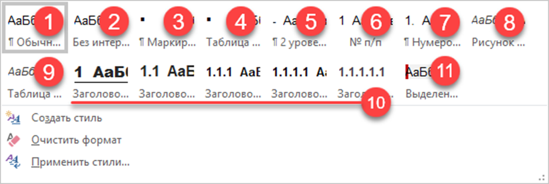

Каждый вновь создаваемый документ имеет следующие параметры:

-  Шрифт Calibri (Основной)

-  Размер шрифта 11

Дело в том, что документ создаётся на основе шаблона. Шаблон документа Word ‒ это файл, на основе которого создаются новые документы. Шаблон документа можно по другому назвать трафаретом, формой или «рыбой». Когда мы создаём новый документ, то по умолчанию он создаётся на основе стандартного шаблона, который называется **Normal.dotm**.

Вы можете каждый раз менять шрифты и другие параметры вручную, но все изменения будут применены только к текущему документу. Вы точно упустите ряд настроек, например, при вставке текста из другого документа, и рано или поздно при работе с документом у вас начнет появляться стандартный шрифт Calibri.

:::note 

**Всегда используйте стили. Никогда не применяйте форматирование вручную.**

Почему это важно?

-  Весь документ будет выглядеть аккуратно и профессионально: все заголовки одного уровня -- одинаковые, все основные абзацы -- одинаковые.

-  Хотите изменить шрифт во всем документе? Не нужно править каждый абзац. Достаточно изменить стиль «Основной текст» -- и изменения применятся ко всему, что к нему привязано.

-  Оглавление строится автоматически на основе заголовков, к которым применены стили.

-  Навигация по документу работает только со стилизованными заголовками.

-  Перекрестные ссылки, нумерация глав -- всё это построено на стилях.

-  Если несколько человек правит документ, стили -- это единый набор правил. Один сотрудник настроил стили, другие их применяют. Без этого документ быстро превратится в визуальный хаос из десятков разных шрифтов и отступов.

:::

Рекомендуется однократно выполнить настройку шаблона и самый простой способ -- заменить стандартный шаблон на настроенный согласно корпоративным требованиям.

Для этого перейдите к месту расположения файла шаблона ***C:\\Users\\ имя\_пользователя*** ***\\AppData\\Roaming\\Microsoft\\Templates*** и сохраните в папку файл [Normal.dotm](./Normal.dotm) заменой стандартного.

Теперь при открытии нового документа WORD вы получите следующий набор стилей:

{width=933px height=313px}



---

*  

   **Номер**

*  

   **Название**

*  

   **Описание**

---

*  

   **1**

*  

   Обычный

*  

   **Стиль основного текста документа.** База для всех остальных стилей. Используется для всего текста, который не является заголовком, списком, цитатой и т.д.

---

*  

   **2**

*  

   Без интервала

*  

   **Для текста внутри таблиц.** Основан на стиле «Обычный», но с уменьшенным межстрочным интервалом. Делает таблицы компактными и удобочитаемыми.

---

*  

   **3**

*  

   Маркированный список (квадрат)

*  

   **Для маркированных списков в основном тексте.** Используйте для перечислений вне таблиц.

---

*  

   **4**

*  

   Таблица список

*  

   **Для маркированных списков внутри таблиц.** Имеет уменьшенные отступы и интервалы, чтобы экономить место и не «раздувать» ячейку.

---

*  

   **5**

*  

   2 уровень

*  

   **Для маркированного списка 2-го уровня (вложенного в Маркированный список (квадрат))**

---

*  

   **6**

*  

   № п/п

*  

   **Для нумерации строк в таблицах.** Шрифт для первого столбца таблицы типа № п/п -- автоматический проставит нумерацию и продолжит ее в каждой новой строке таблицы.

---

*  

   **7**

*  

   Нумерованный список

*  

   **Для нумерованных списков в тексте.** Обратите внимание: если применять к нескольким спискам по тексту документа по умолчанию будет продолжать нумерацию в новом списке со значения на котором закончилась нумерация предыдущего списка. Выделите нумерацию нового списка, нажмите ПМ и выберите начать с 1.

---

*  

   **8**

*  

   Рисунок название

*  

   **Для подписей рисунков**

---

*  

   **9**

*  

   Таблица название

*  

   **Для подписей  таблиц**

---

*  

   **10**

*  

   Заголовки

*  

   **Для заголовков разделов (Заголовок 1, 2, 3 и т.д.).** **Автоматически создают оглавление и структуру документа.**  \
   Обратите внимание: Не удаляйте и не редактируйте номера вручную в тексте. Это собьет всю нумерацию и структуру.

---

*  

   **11**

*  

   Выделенная цитата

*  

   **Для акцентирования важной информации** (например, «Важно!», «Обратите внимание»). Выделяется серым фоном и красной боковой полосой.



Ключевые принципы работы:

1. **Не меняйте существующие стили.** Если вам не хватает функциональности -- создавайте новые стили на основе существующих. Изменение «родных» стилей может привести к непредсказуемым изменениям во всем документе.

2. **Применяйте стили через панель Стили** (вкладка Главная). Выделите текст и щелкните по нужному стилю.

3. **Для автоматизации** (оглавление, нумерация рисунков, перекрестные ссылки) используются только стили Заголовок X, Рисунок название и Таблица название.\
   Следование этим правилам сэкономит вам и вашим коллегам часы работы и гарантирует профессиональный вид любых, даже самых объемных документов.

---

### Создание шаблонов и применение своих шаблонов к чужим документам

Вы можете создавать свои файлы шаблонов, например под разные проекты с разными настройками шрифтов и пр. Для этого скопируйте и откройте файл шаблона Normal.dotm на редактирование (Правая кнопка мышки --Открыть), внесите необходимые изменение и сохраните файл с расширением.dotm и нужным наименованием.

#### Как подключить пользовательский шаблон к документу:

1. Откройте документ, к которому хотите присоединить шаблон.

2. Перейдите: **Файл -> Параметры -> Надстройки**.

3. В разделе **Управление** в самом низу выберите **Шаблоны** и нажмите кнопку **Перейти...**.

4. В открывшемся окне **Шаблоны и надстройки** нажмите кнопку **Присоединить...**.

5. Найдите и выберите файл вашего пользовательского шаблона (с расширением .dotm), который вы создали ранее.

6. **Поставьте галочку** «Автоматически обновлять стили документа».

7. Нажмите **ОК**.

Такой же подход можно попробовать применить к готовым "чужим" документам, НО Word обновляет стили документа, чтобы они соответствовали стилям шаблона, но только если их имена совпадают.

-  Стили с одинаковыми именами будут автоматически обновлены в соответствии с настройками вашего шаблона (шрифт, размер, интервалы, цвет и т.д.).

-  Стили с уникальными именами ("чужие" стили) останутся без изменений.

-  Прямое (ручное) форматирование также не затрагивается. Текст, к которому было применено ручное форматирование, останется таким же. Местное форматирование имеет высший приоритет.

Присоединение шаблона -- это не полная замена дизайна. Это обновление одноименных стилей. Документ не станет на 100% идентичным новому документу, созданному из вашего шаблона. В нем останутся "хвосты" чужого форматирования.