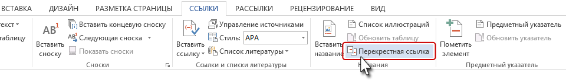
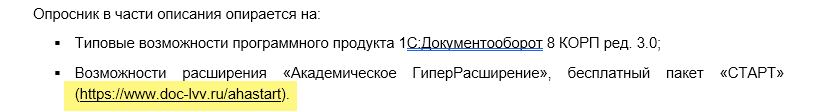
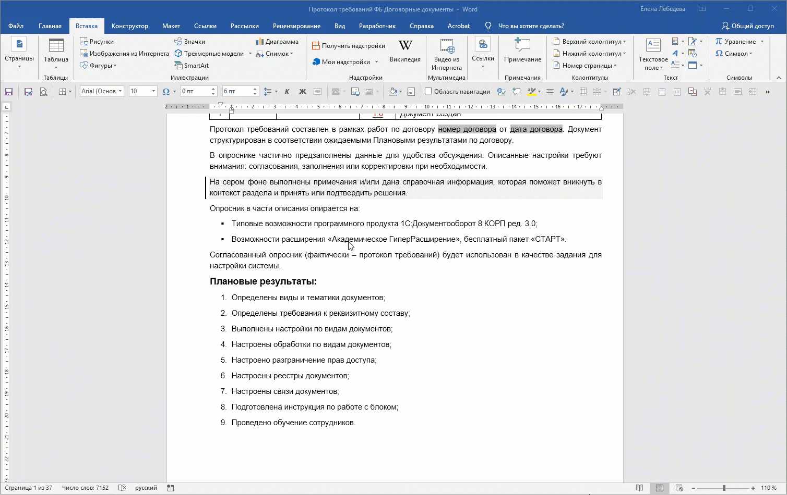

:::note 

**ВАЖНО**

**Перекрёстная ссылка** -- это умное поле, которое содержит код, ссылающийся на номер другого объекта. При обновлении (F9) этот код пересчитывается, и номер меняется. **Обновляется автоматически**.

**Гиперссылка**, даже если она ведет внутрь документа, -- это, по сути, просто адрес, "зашитый" в текст. Если номер раздела изменился, этот "адрес" остался прежним. **НЕ обновляется автоматически**.

**Гиперссылка -- для внешних сайтов. Перекрёстная ссылка -- для навигации внутри документа.** 

:::

## Перекрестная ссылка

Поставьте курсор в месте предполагаемой перекрестной ссылки, например (*см. раздел |* ), перейдите **Ссылка -- Перекрестная ссылка**

{width=960px height=137px}

Появится диалоговое окно:

1. **Тип ссылки:** на какой фрагмент будет организована перекрёстная ссылка. Из выпадающего меню определяем тип перекрёстной ссылки. Перекрестную ссылку можно сделать на абзац, заголовок, закладку, сноску, рисунок, таблицу и т.д.

2. **Вставить ссылку на:** что из себя будет представлять ссылка.  Например,  для заголовка Номер заголовка или Текст заголовка, или для таблицы Название целиком или Постоянная часть и номер.

Если номер раздела поменялся, выделите весь документ (**Ctrl+A**) и нажмите **F9** -- все ссылки станут актуальными.

:::tip 

**Чтобы перейти по ссылке:**

Зажмите **Ctrl** и **кликните** по ссылке. Word переведет вас к нужному разделу или объекту.

**Чтобы вернуться назад:**

Нажмите **Alt + ← (клавиша Влево)**. Это сочетание работает как кнопка Назад в браузере и возвращает вас к тому месту, откуда вы перешли.

:::

{width=1508px height=950px}

## Гиперссылка

Это -- «кнопка» для перехода на внешний ресурс.

❗**Не делайте так**

{width=814px height=111px}

Выделите текст -- Вставка-Ссылка (**Ctrl + K)** -- вставьте адрес.

{width=1508px height=950px}