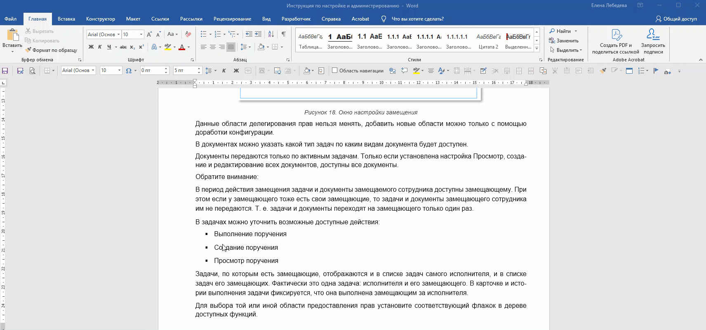

Если по тексту документа вам требуется визуально выделить важную информацию в документе (предупреждение, примечание, ключевую мысль), используйте стиль **Выделенная цитата**

{width=1712px height=802px}